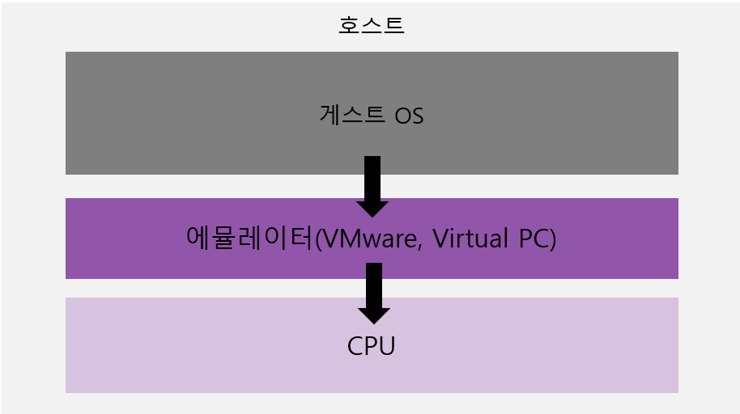
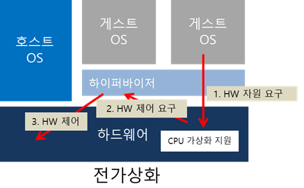
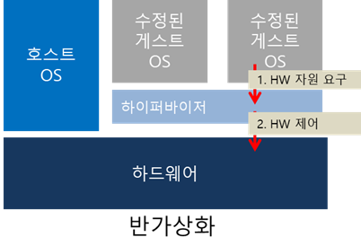

# 왜 AWS인가?
---

## 클라우드 컴퓨팅 이전의 서버운영
- **호스팅 서비스 사용**
  - 월 단위로 사용료를 내는 방식
  - 모든 금액을 선불로 지불해야 하므로 비용 부담이 큼
  - 약정한 트래픽을 넘어서면 서비스가 자동으로 차단 됨
- **서버 직접 구입 혹은 임대**
- **IDC 코로케이션 (Internet Data Center Corocation)**
  - 직접 데이터 센터에 서버를 입주시키는 방식
  - 장점
    - IDC 내부에 설치되므로 빠른 속도의 네트워크 지원
    - 자체 서버를 운영할 수 있음
  - 단점
    - 비싼 서버를 구입 혹은 임대 해야함
    - 월 사용료

**AWS에서는**
- 사용한 만큼 돈을 내고
- 빠른 서버 증설
- 빠른 서버 폐기

## 가상화와 클라우드 컴퓨팅
- 가상화 기술의 초기버전
  
  - VMware, Virtual PC 등
    - 하드웨어와 명령어 모두 에뮬레이션 해야함
      - 매우 느린 속도
- CPU 차원에서 가상화 지원 = **전가상화**

  - HVM(Hardware Virtual Machine) ex) Intel VT-x, AMD-V
  - CPU의 하이퍼바이저(Hypervisor)가 빠른 속도로 처리 해줌 => 성능 향상
- Xen 소프트웨어 하이퍼바이저 = **반가상화**
  
  - 게스트 OS(커널)을 수정해야함
  - 하지만 전가상화보다 훨씬 빠르며 호스트OS와 거의 동일한 성능제공
  - 게스트OS로 많이 사용하는 Linux는 오픈 소스이기 때문에 커널 수정은 큰 문제가 되지 않음

이러한 가상화 기술을 통해 만들어진 서버를 일정 사용료를 받고 서비스 형태로 제공하는 것이 클라우드 컴퓨팅이다.

## 아마존 웹 서비스
### AWS의 획기적인 개선
- 편리한 AWS UI의 웹사이트를 통해 빠른 시간안에 서버 추가, 삭제
- 1시간 단위로 비용 계산
>엄청나게 많은 서버가 준비되어 있으므로 '규모의 경제'효과를 통해 운영 비용이 점점 줄기 때문에 가격도 계속 떨어진다
### IaaS - Infrastructure as a Service
- IT 인프라 제공하는 서비스

> **Amazon과 AWS**
>  세계 최대의 온라인 쇼핑몰 사이트인 amazon은 엄청난 양의 ㅈ데이터를 사용자에게 제공해야합니다. 또한 정확한 결제와 배송처리를 위해 서버에 필요한 다양한 기술들이 개발되었는데 이것이 AWS로 발전하게 되었습니다.

## 스타트업과 클라우드 컴퓨팅
- 스타트업이나 벤처기업의 특징
  - 소수의 인원
  - 부족한 자금
  - 실패할 가능성이 매우 높음
  - 성공했을 경우 급격한 사용량 증가

- AWS의 특징
  - 혼자서 모든 인프라 구축, 관리 가능
  - 초기 비용은 낮고, 사용한 만큼 비용을 지불
  - 사업이 실패하더라도 생성한 서버 자원들을 삭제하면 비용을 떠안지 않아도 된다.
  - 서버 증설과 부하 분산을 자동화할 수 있기때문에 급격한 성장에 대비할 수 있다.