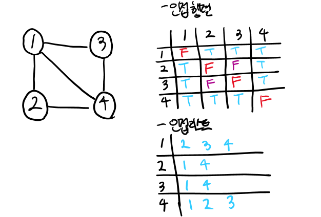

# DFS - 깊이 우선 탐색
---
- 깊이 우선 탐색이라고 부르는 DFS 알고리즘에 대해서 알아보겠습니다.


## 개념
---
#### 깊이 우선 탐색
**DFS - Depth First Search**


한 방향으로 **인접한 노드가 없을 때까지(가장 깊은 노드까지**) 탐색한 뒤 다른 방향으로 탐색을 하는 방식


**☝ 특징**
- **모든 노드를 탐색해야 할 때** 활용하기 좋은 방식
- BFS에 비해 **간단**
- 단순 검색 속도는 BFS에 비해 **느림**

**☝ 탐색 과정**
- 현재 노드에 *인접*하고 *방문된적 없는*(스택에 안쌓인) 노드를 방문
- 현재 노드에서 인접하고 방문된 적 없는 노드가 없을 경우 backtracking하여 다른 방향의 노드를 방문한다.

**☝ 알고리즘 구현**
구현 방식에는 **행렬**(2차원 배열)로 구현하는 **인접 행렬 방식**과 **연결리스트**로 구현하는 **인접 리스트** 방식이 있다.
- 또한 기본적으로 스택을 사용하여 방문처리를 구현하기 때문에 실제로는 재귀 함수를 사용하면 매우 간결하게 구현할 수 있다.


- **Adjacency Matrix - 인접 행렬**
```python
#위의 그래프를 2차원 리스트로 표현하면
graph = [
    [0,1,1,1],
    [1,0,0,1],
    [1,0,0,1],
    [1,1,1,0]
]
```

- **Adjacency List - 인접 리스트**
```python
#위의 그래프를 인접 리스트(1차원 리스트)로 표현하면
graph [[2,3,4],[1,4],[1,4]],[1,2,3]
```
- 실제 구현
```python
def dfs(graph, v, visited):
    #V : 현재 노드
    visited[v] = True
    print(v, end=' ')
    for i in graph[v]:
        if not visited[i]:
            dfs(graph, i, visited) #현재 노드와 인접한 다른 노드를 재귀적으로 방문
    

# 인접리스트 배열 -> graph[][]
# 방문여부 배열 -> visited[]
graph = [
    [],
    [2, 3, 8],
    [1, 7],
    [1, 4, 5],
    [3, 5],
    [3, 4],
    [7],
    [2, 6, 8],
    [1, 7]
]

visited = [False] * 9
# 최상단 노드 1
dfs(graph, 1, visited)
```