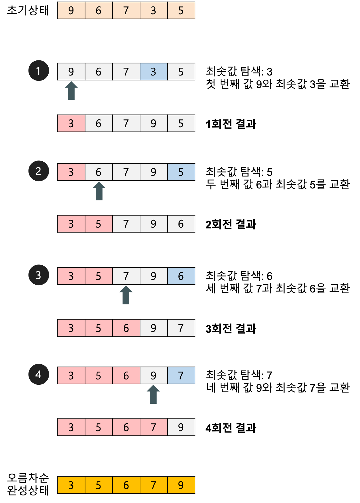

# Selction Sort - 선택정렬
---

## 정렬(Sorting)
---
데이터를 특정한 기준에 따라서 순서대로 나열하는 것

- 내림차순 정렬
- 오름차순 정렬
등등

## 선택 정렬(Selection Sorting)
---
### 개념
- 제자리 정렬(in-place sorting) 알고리즘의 하나
    - 입력 배열(정렬되지 않은 값들) 이외에 다른 추가 메모리를 요구하지 않는 정렬 방법
- 해당 순서에 어떤 원소를 넣을지 선택하는 알고리즘

### 특징
- 자료 이동 횟수가 미리 결정된다.
- 값이 같은 레코드가 있는 경우에 상대적인 위치가 변경될 수 있다.
> 시간복잡도
    O(n^2)

### 예시


- 첫번째 자료를 두번쨰자료부터 마지막 자료까지 차례대로 비교하여 가장 작은 값을 찾아 첫번째에 놓고, 두 번째 자료를 세번째 자료부터 마지막 자료까지와 차례대로 비교하여 그 중 가장 작은 값을 찾아 두번째 위치에 놓는 과정을 반복하며 정렬을 수행한다.

### 구현
```python
def selection_sort(arr):
    for i in range(len(arr)):
        for j in range(i+1, len(arr)):
            if arr[i] < arr[j]:
                arr[i], arr[j] = arr[j], arr[i]
    return arr
