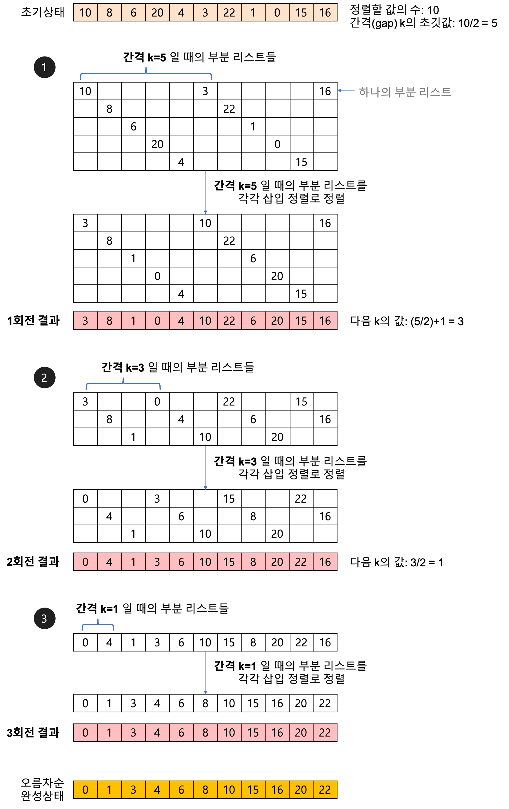

# Shell sort - 셸 정렬
----

## 개념
삽입정렬을 보완한 알고리즘으로, 전체 리스트를 **간격(Gap)으로 나누어 부분리스트**를 만들고 각 부분리스트를 삽입 정렬로 정렬한 후 간격을 절반으로 줄여 정렬하는 알고리즘이다.


## 특징
- 삽입정렬의 경우 정렬될 위치가 먼 위치에 있다면 그만큼 시간복잡도가 늘어나지만 그에 비해 최종위치에 있을 가능성이 높아진다.
- 부분 리스트는 어느 정도 정렬이 된 상태이기 때문에 부분 리스트의 개수가 1이 되게 되면 삽입정렬보다 더욱 빠르게 수행된다
- 간단한 구현
> 시간복잡도
**O(n^2)**

## 예시


## 구현
```python
# 오름차순 정렬
def shell_sort(arr):
    n = len(arr)
    h = n // 2
    while h > 0:
        for i in range(0, h):
            insert_sort(arr, i, n-1, h)
        h // 2
    return arr

def insert_sort(arr, first, last, h):
    i = first + h
    while i <= last:
        val = arr[i]
        pos = i
        while pos > first and arr[pos-h] > val:
            arr[pos] = arr[pos - h]
            pos -= h
        arr[pos] = val
        i += h
    
```