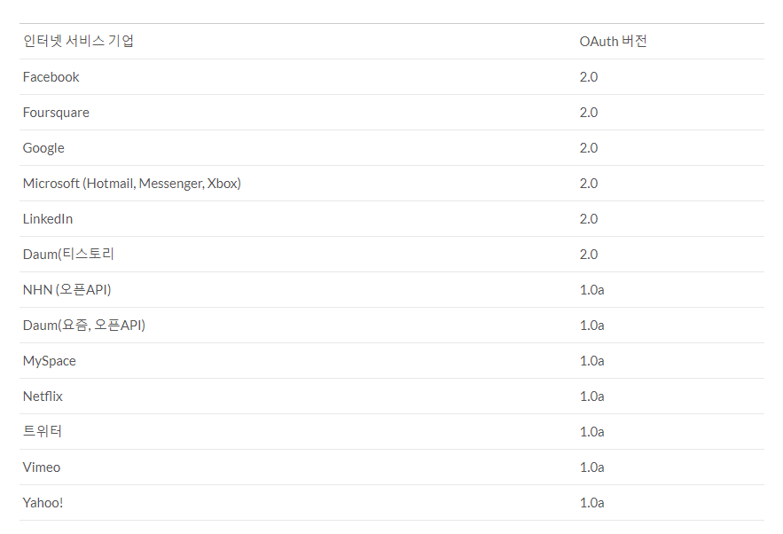
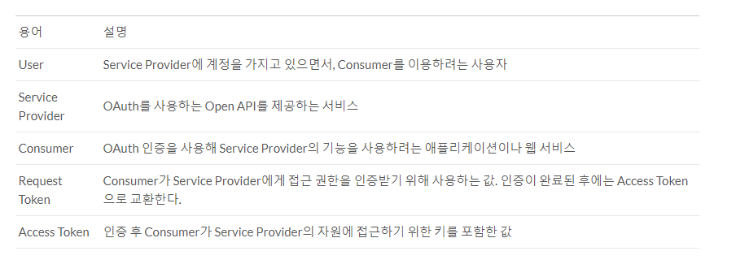
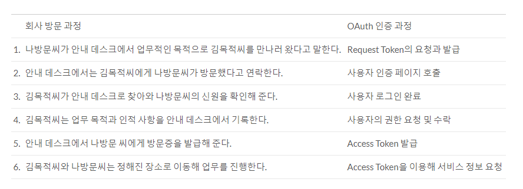

# OAuth


최근 인터넷 서비스들은 그 자체가 SaaS(Software as a Service)의 형태입니다. 서비스 중에서 사용자가 **일부 필요한 것**만 사용할 수 있게 한다는 것입니다. 이것은 **별도의 인증절차를 거치면 다른 서비스에서 해당 서비스의 기능을 일부 이용할 수 있게 되는 것**으로 발전하였습니다. 이때 사용하는 인증 절차가 바로 **OAuth**입니다.


## 개념
---
- **OAuth**는 인터넷 사용자들이 비밀번호를 제공하지 않고 다른 웹사이트 상의 자신들의 정보에 대해 웹사이트나 애플리케이션의 접근 권한을 부여할 수 있는 공통적인 수단으로서 사용되는, **접근 위임을 위한 개방형 표준**입니다.

## 탄생 배경
---
> OAuth 이전의 API 접근 위임(API Access Delegation)을 위한 시도들
- OAuth의 탄생이전에도 Google, Yahoo!, Amazon등의 기업들에서는 다른 애플리케이션에 사용자의 *아이디와 암호가 노출되지 않도록* 하면서 *API 접근 위임*(API Access Delegation)이 가능한 여러 인증방법을 *자체적으로* 개발해 사용 중이었습니다.
- 2006년 **API접근 위임에 대한 표준안이 없다**는 것을 인지한 Twitter의 개발자와 Gnolia의 개발자가 만나 인증방식을 논의하고 지지하는 사람도 생기게 되면서 2008년 IETF(국제 인터넷 표준화 기구)에서 논의가 있었고 이후 *2010년에 OAuth 1.0프로토콜 표준안이 정식으로 RFC5849로 발표*되었습니다.

- 현재 나와있는 OAuth2.0은 드래프트 단계(초안)에 있는 것으로, OAuth 1.0과 호환되지는 않지만 인증 절차가 간략하다는 장점이 있어 최종안이 나오지 않았음에도 여러 서비스에서 사용중이었습다.


- 주요기업들이 사용중인 OAuth 버전

## OAuth와 로그인
---
#### 본질적으로 로그인과 OAuth는 다르다!
```
- 나방문씨(외부 손님)가 안내 데스크에서 업무적인 목적으로 김목적씨(회사 사원)를 만나러 왔다고 말한다.
- 안내 데스크에서는 김목적씨에게 나방문씨가 방문했다고 연락한다.
- 김목적씨가 안내 데스크로 찾아와 나방문씨의 신원을 확인해 준다.
- 김목적씨는 업무 목적과 인적 사항을 안내 데스크에서 기록한다.
- 안내 데스크에서 나방문 씨에게 방문증을 발급해 준다.
- 김목적씨와 나방문씨는 정해진 장소로 이동해 업무를 진행한다.
```
- 위의 글은 OAuth의 발급 과정과 권한을 예시로 든것입이다.
- 방문증 == OAuth, 사원증 === 로그인
- 즉, 방문증을 가진 사람이 출입할 수 있는 곳과, 사원증을 가진 사람이 출입할 수 있는 공간이 다르듯이 OAuth를 통해 권한을 인증받은 사용자와 로그인하여 인증받은 사용자가 할 수 있는 일은 다릅니다.

``` 
OAuth => O + Auth => O + Authentication(인증) + Authorization(허가)
```
- 그렇기 때문에 OAuth인증을 진행할 때 서비스 제공자는 다음과 같이 '제 3자가 어떤 정보나 서비스에 사용자의 권한으로 접근하려 하는데 허용 하겠나?'라는 안내 메시지와 동의 페이지가 필요합니다.


## OpenID와 OAuth
> OpenID : 인증을 위한 프로토콜, HTTP사용
> - 하지만 OpenID의 목적은 인증이지만, OAuth의 주요 목적은 허가입니다.
> - 즉, OpenID는 로그인하는 행동과 더 비슷합니다.

## 구성요소와 인증 절차
---

### OAuth Dance, OAuth 1.0 인증 절차
- *OAuth를 이용하여 인증을 하는 과정*을 **OAuth Dance**라고 합니다.
- OAuth를 이해하기 위해 몇 가지 용어들이 있습니다.



- 인증 과정


- 인증 과정 예시


> 더 구체적인 내용은 [naverd2oauth](https://d2.naver.com/helloworld/24942) 를 참고하세요

## OAuth 2.0
- OAuth 1.0은 위에서 봤듯이 **복잡한 절차**, 일반 애플리케이션에서는 사용하기 곤란하기 때문에 OAuth 2.0이 단점을 개선시켜 나온 것입니다. OAuth 1.0과는 호환성이 없고 최종안이 아직 발표되지 않았지만 여러 서비스에서 사용중입니다.

- **특징**
- 웹 애플리케이션이 아닌 **애플리케이션 지원 강화**
암호화가 필요 없음 HTTPS를 사용하고 HMAC을 사용하지 않는다.
- Siganature 단순화 정렬과 URL 인코딩이 필요 없다.
- **Access Token 갱신** : OAuth 1.0에서 Access Token을 받으면 Access Token을 계속 사용할 수 있었다. 트위터의 경우에는 Access Token을 만료시키지 않는다. OAuth 2.0에서는 보안 강화를 위해 ***Access Token의 Life-time을 지정할 수 있도록*** 했다.