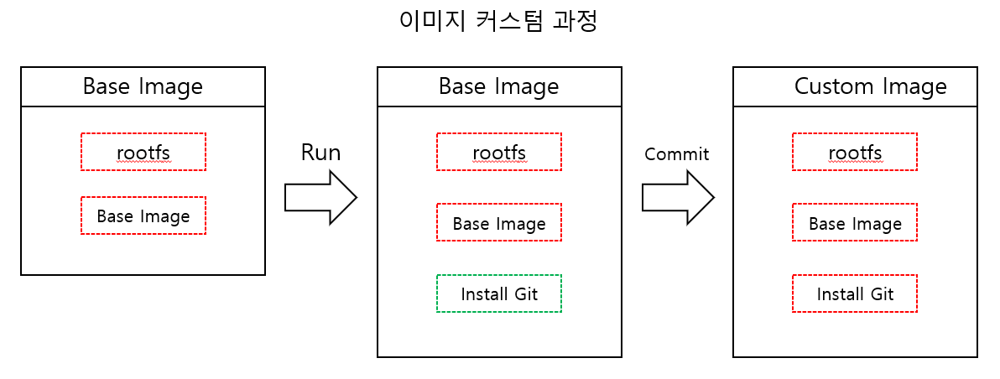

# Docker

## 배경

---

일반적으로 서버를 관리하는 것은 복잡하고 어려운 업무에 속합니다. Ubuntu, Windows, MacOS 등 각기 다른 OS환경이 있고 사용하는 라이브러리나 버전 등 **환경은 매우 다양**합니다.

**DevOps**의 등장과 함께 개발주기가 짧아지며 배포는 더 자주 이루어지고 마이크로서비스 아키텍처가 유행하면서 **프로그램은 더 잘게 쪼개어져 관리는 더 복잡**해집니다. 또한 클라우드의 발전으로 설치해야할 서버가 수백, 수천대에 이르는 복잡한 상황에 처해있습니다.

이와 같이 각기 다른 환경에서 빠르고 신속하게 프로그램을 실행할 수 있도록 나온것이 바로 '**도커(Docker)**'입니다.

## Docker란?

---

### **컨테이너 기반의 오픈소스 가상화 플랫폼**


- 컨테이너라 하면 배에 싣는 네모난 화물 수송용 박스를 생각할 수 있습니다. 각각의 컨테이너 안에는 다양한 종류의 화물을 넣을 수 있고 트레일러 등의 다양한 운송수단으로 쉽게 옮길 수 있습니다.
- 도커에서 이야기하는 컨테이너도 다양한 프로그램, 실행환경을 컨테이너로 추상화하고 동일한 인터페이스를 제공하여 프로그램의 배포 및 관리를 단순하게 해줍니다. 백엔드 프로그램, DB 서버 등 어떤 프로그램도 컨테이너로 추상화 할 수 있고 AWS, Azure, Google Cloud 등 어디서든 실행할 수 있습니다.

## Docker의 특징

### 컨테이너

---

> 개념

- 격리된 공간에서 **프로세스**가 동작하는 기술
  
  > > 기존 가상화 방식과의 차이점
  > >
  > > - 기존 방식 : OS 가상화 (전가상화) ex) VMWare, VirtualBox 등
          -> 여러 OS를 가상화할 수 있고 사용법이 간단하지만 무겁고 느려서 운영환경에서 사용할 수 없습니다.
          => 하드웨어 가상화 방식
  > > - KVM과 반가상화 방식의 Xen : CPU의 가상화기술(HVM)
          -> 게스트 OS가 필요하지만 전체 OS를 가상화하는 방식이 아니었기 때문에 전가상화방식에 비해 성능이 향상되었습니다.
          => 소프트웨어로 구현된 하드웨어

전가상화와 반가상화 모두 추가적인 OS를 설치하여 가상화하는 방식이었기 때문에 **성능문제**가 존재했습니다. 이를 개선하기 위해 나온것이 바로 **프로세스를 격리** 하는방식입니다.

- **리눅스 컨테이너**
  - 컨테이너를 통해 **프로세스를 격리**시키는 방식
  - 단순히 프로세스를 격리하기 때문에 **가볍고 빠르게 동작**합니다.
  - **CPU나 메모리는 프로세스가 필요한 만큼만 추가로 사용하기때문에 성능적으로도 거의 손실이 없습니다.**
  - **하나의 서버에 여러개의 컨테이너**를 실행할 수 있습니다.
  - 또한 CPU나 메모리 사용량을 **제한** 할 수 있고 특정 포트와 연결하거나 특정 디렉토리를 사용할 수 있습니다.

### 이미지

---


- 특정 프로세스를 실행하기 위한 환경
- **컨테이너 실행에 필요한 파일과 설정값등을 포함하고 있는 것**
- **게층화**된 파일 시스템
- 즉, 컨테이너는 이미지를 실행한 상태라고 볼 수 있습니다.
- 이미지는 컨테이너를 실행하기 위한 모든 정보를 가지고 있기 때문에 더 이상 의존성 파일을 컴파일하고 이것저것 설치할 필요가 없습니다.
- 누구나 도커 이미지를 [Docker hub](https://hub.docker.com/)에 등록하거나 [Docker Registry](https://docs.docker.com/registry/)를 직접 만들어 관리할 수 있습니다.

## 컨테이너가 필요한 이유

- **_컴퓨터의 환경은 보편적이지 않습니다._**
  - 컴퓨터는 OS, 버전, 시스템 설정, 설치된 소프트웨어 등 다양한 환경이 존재합니다.
  - 상태관리를 할 경우 여러 시스템에 같은 환경을 제공해야하는데 거의 불가능... 아주 어렵습니다.
  - 하지만 Docker는 이미지를 통해 **꺠끗하고 동일한 환경을 제공**하기 때문에 손쉽게 상태관리가 가능합니다.
  - 또한 이미지는 만약 처음 이미지를 빌드할 떄 실행에 성공했다면 이미 실행이 보장되는 것이기 떄문에 아주 강력한 portable앱으로 볼 수 있습니다. => **재현성**

### Docker 서버와 클라이언트

- 컨테이너 = OS의 가상화를 도와주는(macOS의 경우 xhyve) 프로그램에서 실행된 프로세스

## Docker Command

---

### 이미지 실행

```
docker run (<옵션>) [이미지 식별자] (<명령어>) (<인자>)
```

- 이미지가 다운로드 되어있지 않은 경우에는 해당 이미지 자동 다운로드

- Options
  - -d : 컨테이너 백그라운드 실행

```
docker run -d exampleimage/exampleimage
```

- -p [호스트OS 포트]:[컨테이너 포트] : 호스트OS와 컨테이너 간의 포트 공유를 위해 사용

```
docker run -p 8080:8080 exampleimage/exampleimage
```

- -w : Dockerfile의 WORKDIR 설정을 덮어쓰기 위해 사용
- --rm : 컨테이너를 일회성으로 실행할 때 주로 사용

### 설치된 이미지들 확인

```
docker images
```

### 실행된 컨테이너 확인

```
docker ps
```

### 이미지 변경사항 확인

```
docker diff [Container ID]
```

- 다운로드 받은 Base Image에서 바뀐 모든 파일들 출력

### 새로운 이미지 생성(컨테이너가 존재할 때)

```
docker commit [Container ID] [new Image name]:[tag]
```

> 

### Dockerfile로 이미지 생성

- Dockerfile
  - 이미지 생성 과정을 기술한 Docker 전용 DSL
  - Dockerfile 명령어

```
FROM [Base Image] : 베이스 이미지 지정

ADD [추가할 파일] [파일이 추가될 경로] : 파일 추가 (현재 경로 하위에 있는 파일들만 추가 가능)

RUN [명령어] : 명령어 실행

WORKDIR [디렉토리] : 작업 디렉토리 변경

ENV [환경변수명] [VALUE]: 환경변수 기본값 지정

EXPOSE [포트번호] : 컨테이너 실행 시 노출시킬 포트 (expose를 지정하더라도 docker run시에 -p 옵션으로 호스트의 포트와 컨테이너의 포트를 지정해야함)

CMD [명령어] : 이미지의 기본 명령어 설정
```

- Dockerfile에 작성된 이미지 빌드

```
docker build -t [ID]/[new image name]:[tag] .
```

- . : 해당 경로 하위 파일들을 모두 이미지로 생성

### 이미지 이름 변경

```
docekr tag [image name] [new image name]
```

### 이미지 삭제

```
docker rmi [image name]
```

### Docker registry에서 이미지 받아오기

```
docker pull [image name]
```

### Dockerfile

> COPY vs ADD

두 명령어 모두 로컬환경에 있는 파일을 컨테이너에 추가하는 명령어이다.
ADD가 먼저 만들어진 명령어인데 그 이유는 이름에서 유추할 수 있다.
COPY는 로컬의 파일을 컨테이너에 단순 복사하는 명령어이고 ADD는 COPY와 같이 복사하는 기능도 있지만 추가 기능으로 [source]에 url을 입력하면 다운로드하여 컨테이너에 추가된다. 그리고 특정 포맷의 압축파일이 [source]인 경우에도 압축을 해제하게 되는데, 이때 단순하게 압축파일을 넘기고 싶을 때 문제가 되어 단순 복사만 하는 COPY 명령어가 만들어진 것이다.
