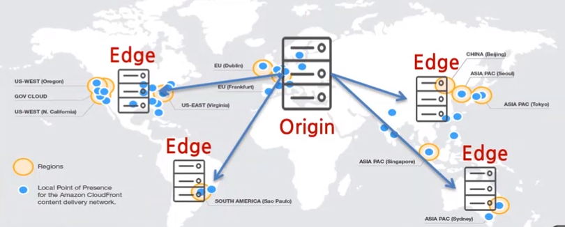
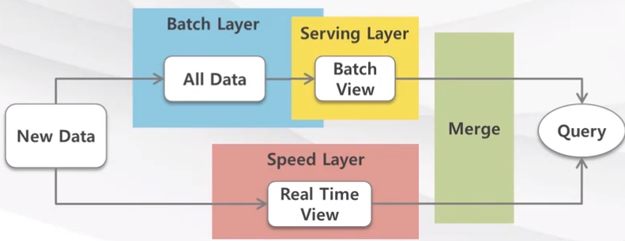

# AWS Essential(4)
- T academy AWS essential 강의
---

## 지역 및 가용영역
---
### Region
- Region은**Availability-가용영역**이라고 불리는 **물리적으로 격리된 데이터 센터들의 집합**이며 이 가용영역에서 인스턴스와 데이터를 배치/저장/구성할 수 있도록 지원한다.

### Availability
가용영역은 하나의 지역 안에 속하며 기본적인 서비스 구성이 가능하도록 IT자원 제공

- 사용자가 직접 가용영역 선택 및 인스턴스 배치 가능
    - 서비스 가용성⬆
- 또한 **하나의 지역에 여러개의 가용영역(이하 AZ)이 존재**하며 AZ들은 **전용 사설 네트워크**를 통해 **낮은 네트워크 응답시간을 보장**

### Edge
**컨텐츠 전송 네트워크-CDN**로서 웹 자산의 전송을 가속화 하는 서비스
- **HTTP/HTTPS** 프로토콜을 사용하여 콘텐츠를 다운로드/업로드 하거나 **RTMP** 프로토콜로 콘텐츠를 **스트리밍하여 배포** 할 수 있다.

## AWS 컴퓨트 서비스
---

## 개념
AWS에서는 어플리케이션의 요구에 맞게 다양한 컴퓨팅 서비스를 제공한다

> Ex
> 가상 컴퓨팅 자원(EC2) -> 탄력적인 웹스케일의 컴퓨팅이나 병렬작업 처리 가능

## 대표 서비스
### EC2 - Elastic Compute Cloud

AWS에서 가장 기본이 되는 ***Low-Level 빌딩 블럭에 속하는 컴퓨팅서비스***
- EC2를 통해 **가상서버를 구축하고 보안 및 네트워크 구성과 스토리지 관리**

- AMI로 나누어 EC2 인스턴스 배포

**구성요소**
- 인스턴스
가상 컴퓨팅 환경
- AMI
Amazon 머신이미지, 인스턴스에 필요한 OS와 소프트웨어가 구성된 템플릿
- 인스턴스 타입
가상 서버의 CPU, Memory 사이즈 용량
- EIP(Elastic IP)
가상 컴퓨팅 서버에 할당되는 고정 공인 IP => VPC 위에 사설 IP로 위치하게 되는데 이렇게 되면 외부에서 사용할 수 없기 떄문에 고정 공인 IP를 할당시켜준다
- VPC
가상의 컴퓨팅 서버가 속하는 독립된 네트워크 블럭

### Lambda

이벤트에 응답하여 코드를 실행하고 자동으로 기본 컴퓨팅 **리소스를 관리하는 서버 없는 컴퓨팅 서비스**

- EC2 처럼 서버를 할당하는 것이 아니기 때문에 Abstracted Infra Structure에 해당되며 백엔드 서버와 운영 체제 유지 관리, 용량 프로비저닝, Auto-Scaling, 코드 및 보안 배포 , 모니터링, 로깅 등 다양한 컴퓨팅 리소스 관리를 수행합니다.

### 컴퓨트 서비스 장애에 대한 디자인
- 확장성
- 모니터링 및 운영 관리
API, Dashboard
- 이중화
여러 AZ에 DB를 구성(master-slave)하여 단일요소의 장애 제거
- Failover
EIP, Disk를 별도로 관리 => 장애가 났을 시에 detach하여 정상서버에 attach

### AWS Database 서비스
aws db 서비스는 데이터베이스의 용량과 성능에 맞게 조정 가능하며 패치, 백업, 확장 등의 작업들을 해준다.

관계형 데이터베이스는 **RDS**, 비 관계형 데이터베이스는 **DynamoDB**등으로 서비스

> ▶ ***RDB - 관계형 데이터베이스***
> **키 값에 의해 서로 관련되는 테이블로 구성**
> RDB가 효율적으로 동작하기 위해 **ACID 트랜잭션** 특징을 가지고 있다.
> - Atomicity(원자성)
> - Isolation(고립성)
> - Consistency(일관성)
> - Durability(지속성)

> ▶ ***NoSQL - 비 관계형 데이터베이스***
> **스키마가 존재하지 않으며 키가 아닌 다른 속성인 값에 대해서는 제한이 없다**.
> DynamoDB는 JSON을 비롯한 다양한 데이터형식으로 저장할 수 있다.
> **BASE**의 특징을 갖는다.
> - Basically Available - 항상 사용 가능
> - Soft-state - RDB보다는 느슨한 관계
> - Eventually consistency

### DB 장애에 대한 디자인
- 확장성
AZ단위로 확장 가능, 다른 AZ로의 구성가능
- 백업 및 운영 관리
API, Dashboard
- 이중화
- Failover
데이터가 소결합으로 저장되어 대체작동 가능