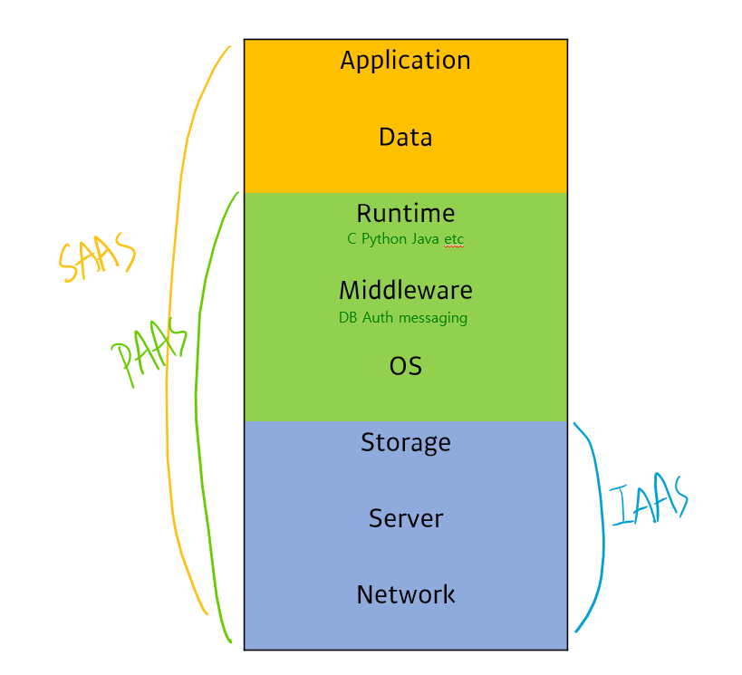

# AWS Essential(1)
- T academy AWS essential 강의
---

## 클라우드 컴퓨팅 개요
- 클라우드 컴퓨팅(Cloud Computing)
네트워크를 통해 다양한 IT리소스들을 온디맨드로 제공하는 서비스
> 온디맨드(On-Demand)
> 요구사항에 따라 **즉시 제공/공급** 하는 방식

### **구분**
대상에 따라 나뉨

| 구분 | 대상 | Ex |
|---|:---:|:---|
| 퍼블릭 | 일반 사용자 | AWS, Azure, GCP |
| 프라이빗 | 내부 사용자 | OpenStack, Cloudstack |

>💡 최근에는 퍼블릭과 프라이빗 클라우드를 합친 **하이브리드 클라우드 형태**를 사용
>- 외부에서 오는 많은 트래픽 - 퍼블릭 클라우드
>- 사내 전산망 - 프라이빗 클라우드

### **분류**

- **SAAS(Software As A Service)**
플랫폼 내에서 소프트웨어화되어 제공되는 것
ex) Gmail, Google Analyyics
- **PAAS(Platform As A Service)**
데이터베이스, 큐, 인증시스템 등이 플랫폼 레벨에서 서비스화되어 제공되는 것
- **IAAS(Infrastructure As A Service)**
서버, 스토리지(디스크), 네트워크가 서비스 화되어 제공되는 것

### **특징**
- **온디맨드한 접근성**
필요할 때 편리하게 접근가능
    ex) VOD(Netflix, wavve 등)
 - **대규모의 확장성**
온디맨드한 클라우드 컴퓨팅의 특징 때문에 큰 트래픽 발생
 - **종량제 과금정책**
사용한만큼 과금지불
 - **관리의 편리성**
이전의 환경에서는 하나의 인프라 스트럭처마다 관리자나 보안환경이 필요했지만 관리해야 했지만 클라우드 환경에서는 해당 클라우드 환경을 제공하는 곳(AWS, GCP, MS Azure etc)에서 관리하기 때문에 편리함

### **장점**
**비즈니스적 측면**
- 초기 인프라 자원 투자에 대한 부담 감소
- 사용한 양에 따른 비용(종량제) 지불
- 즉각적인 인프라 자원 제공
- 효율적인 자원 할당 및 관리
- Time to Market 시간 절감

**기술적인 측면**
- Automating(프로그래밍 가능한 인프라자원)
- Auto-Scailing, 탄력적인 확장
- 개발 lifecycle 단축 (Dev - Stage - Prod)
- 검증 절차(QA) 향상
- 대규모의 트래픽 수용 가능(Load Balancer 등)
- 비즈니스 연속성과 재해 복구
    다른 지역으로 서비스를 확장할 때에도 쉽게 이동 가능

### 고려사항
- **개인정보 보호**
- **요구된 보안수준 확보**
다양한 IT인프라가 모여있기 때문에 네트워크나 암호화를 통해 기존 시스템보다 높은 수준의 보안확보
- **서비스의 가용성 확보**
장애상황에서의 대처
- **제한사항에 따른 요구사항 파악**