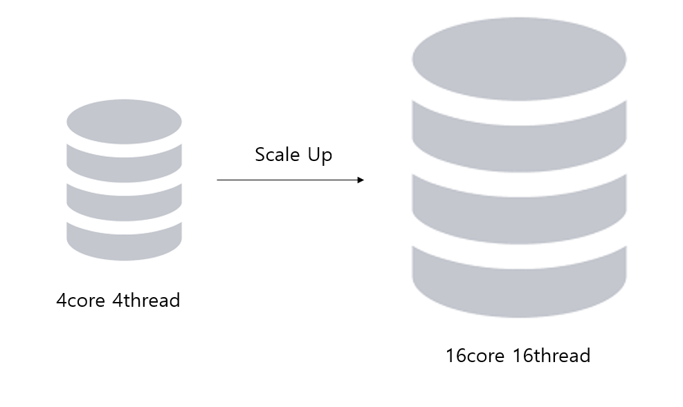
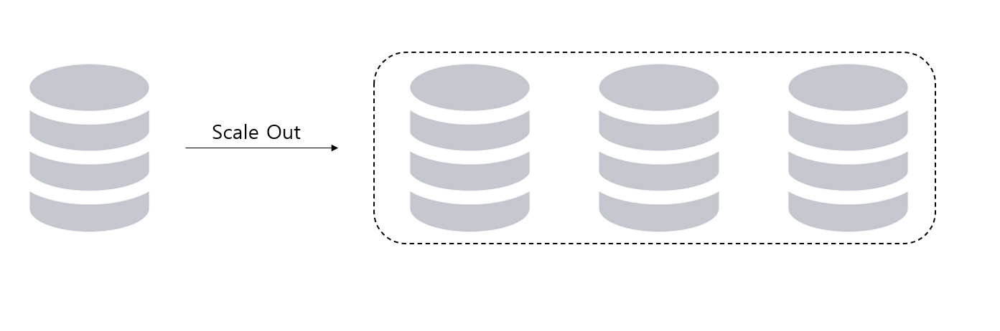
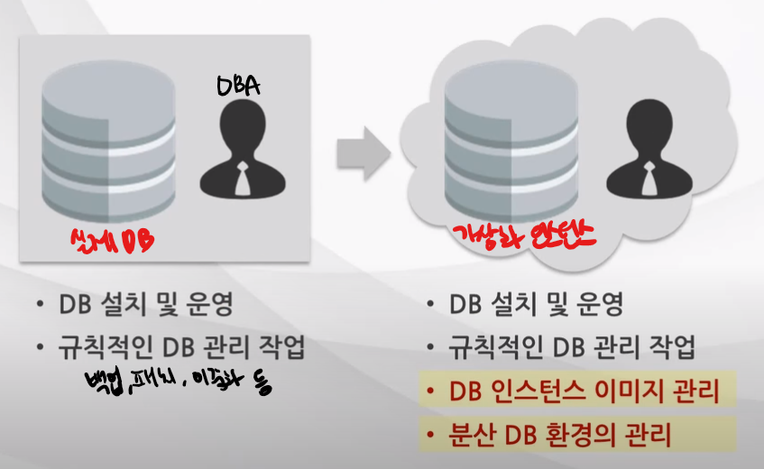

# AWS Essential(2)
- T academy AWS essential 강의
---

## 확장성 있는 설계
---
### 개념
클라우드는 확장성의 개념을 가지고 디자인 되어 있으며 확장성이 있는 서비스 설계 가능

- 서비스 레벨에서 병목과 획일적인 구성 요소들을 확인하여 효율적으로 설계를 개선하여 클라우드의 이점 

### 특징
- **리소스 증가에 비례한 성능의 증가**
- **회복력**
(==확장성)트래픽에 따른 탄력적인 구조 설계
- 분산된 시스템의 관리 능력
- 효율적인 운영 방법
모니터링, 임계값 설정 등 
- **비용의 효율적인 관리**

### 설계 형태

**Scale Up / Down(수직적)**

네트워크, 서버의 Usage에 따라 **서버의 자체 성능을 증가, 감소**시키는 방식
* 확장성 한계의 문제점

**Scale Out / In(수평적)**

**병렬적으로 서버의 수를 늘리는** 방식
* 클라우드 환경에서 많이 사용하는 방식

## 탄력성
---
### 개념

최소한의 마찰로 리소스를 스케일링 가능하게하는 특징

- 어플리케이션 구조에 클라우드 이점을 충분히 적용할 수 있도록 **탄력성의 개념을 가지고 설계**한다.
- 필요한 자원들만 활용하도록 **간소화 한 시스템 설계 및 프로세스의 관점 변화** 필요
- 리소스를 서비스 양에 맞게 *즉각적으로 늘리고 줄이는*(On-Demand) 프로세스를 **자동화**하고 이용률을 높이는 작업 적용

### 구조
- 전통적인 방식의 비탄력적인 구조
실 서비스 트래픽에 맞게 인프라를 증설하지만 예상치 못한 트래픽의 다운은 **용량 낭비**로 이어지는 비효율적인 구조를 만들어냄

- 클라우드 방식의 탄력적인 구조
탄력성의 특성에 맞게 Scale Up/down, Scale Out/In 을 통해 실사용량에 맞추어 탄력적으로 스케일링 하여 효율적인 인프라 구축

### 제약에 대한 극복
- 시스템의 요구사항이 클라우드에서 충분히 제공되는지, 충족되지 않는 부분은 어떻게 극복해야 하는지 고민

- 온프라미스 환경과 동일한 하드웨어 혹은 솔루션을 활용하기 어렵다는 것을 이해하고 클라우드 환경에서 제공하는 추상화된 자원들을 활용하여 서비스를 제공할 수 있도록 관점의 변화 필요
> 💡 **온프라미스 (On-Premise)**
> 내부에 자체구축된 시스템(IDC)

> 사례
DB 읽기 성능 확보 사례
>- **IDC(On-Premise) 환경**
성능이 부족할 때 메모리를 추가하여 성능을 확보함
>- **클라우드 환경**
HW리소스를 추가할 수 없기 때문에 DB에 저장된 데이터들을 Redis라는 인메모리 DB에 넣는 방식을 통해 읽기 성능을 확보 함

## 가상화 시스템 관리자
---
### 시스템 관리자(SE)의 역할 
**클라우드로의 변화에 따라 가상화 시스템 관리자의 역할을 수행해야 함**

- 과거 축소되었던 관리자의 역할 보다 최적의 비즈니스를 이끌어낼 수 있도록 다양한 부분에 대해 관심과 노력 필요
- 시스템 관리자는 **기술 레벨의 확장이 필요**하며 **추상화된 클라우드 리소스에 대해 제어, 관리 서비스의 기능을 제안할 수 있는 역량**이 필요

> Ex) DBA의 역할 변화
