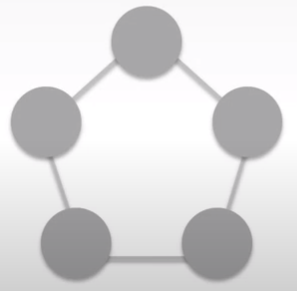

# AWS essential(5)
- T academy AWS essential 강의
---

## 컴포넌트 소결합
---

**SOA 설계 원칙**
*'더 큰 확장을 위해 시스템의 구성요소를 보다 소결합(loose coupled) 한다.'*

**밀결합(tight coupled) 지양**
- 하나의 구성요소에 문제가 발생하였을 때 다른 구성요소는 해당 문제와 상관없이 **지속적으로 서비스 가능**해야 한다.

- **소결합 - Loose Coupled**
단계별 독립된 방식

* 하나의 컴포넌트에 장애가 발생해도 다른 서비스들은 정상적으로 작동
- **밀결합 - Tight Coupled**
절차지향적 방식
*서로 밀접하게 연관 되어 있음

#### 탄력성 있는 구성
- 탄력성을 구현하기 위해 배포 절차를 자동화하고 구성을 간소화하는 프로세스 구성 필요
- 사용자의 개입 없이 확장 필요
- 자원의 효율성과 비용효율성을 가져온다.

#### 동시성 있는 구성
- 클라우드는 작업을 병렬화하고 자동화 할 수 있음

#### 보안을 고려한 구성
- 보안은 모든 어플리케이션 계층에 적용되어야하는 필수적인 조건이며 특히 클라우드와 같은 멀티테넌시 환경에서는 보안이 가장 중요한 고려사항이다.

* multi-tenancy 
특정 사용자들이 특정자원들의 물리적인 자원을 공유하며 서로의 환경에 대해 논리적으로 분리하고 접근을 제어하며 사요하는 구성환경

**보안 구성 방법**
- 데이터 전송시 정보 보호 - encrypt, crypt
- 저장에 대한 정보 보호 - encrypt, crypt
- 어플리케이션의 보호 - 네트워크 레벨에서의 보호(Firewall, waff)
- 클라우드 자원의 보호 - 클라우드 접속시에 access key 등
- 사용자 권한 에 대한 보호 - Admin 계정 및 다수의 사용자에 대한 권한 부여