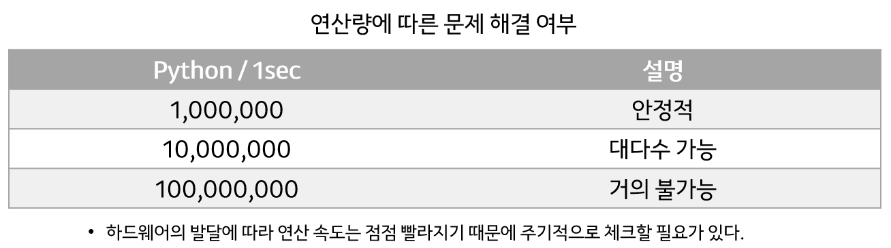
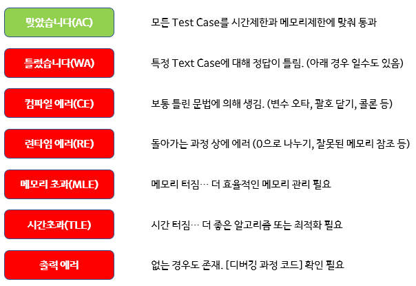

# 읽기와 분석 (시간복잡도/공간복잡도)
---

### 📄 읽기와 분석
- 알고리즘 문제 해결의 가장 중요한 것
- 문제의 조건들을 추상화하는 연습
- 시간복잡도/공간복잡도 어림잡기

### 시간복잡도
---
- 어떤 이유로 코드의 실행 시간이 오래 걸릴까? => **연산량**
- 연산량은 어떤 값과 상관이 있을까? => **입력**

- 모든 연산을 Counting 할 수 있을까? => **X**
- 최악의 경우와 최선의 경우? => **X**
- Counting에 따라 실행시간은? => **X**
=> 다양한 이유(하드웨어 차이, 연산 처리속도 등등)로 **정확한 실행시간이나 시간복잡도를 구하기는 힘들다**

그래서!

#### 😁 **대충 계산하자 => 점근적 표기법**
표현법 : **Big-O Notation**
- 입력이 N일때, 연산 횟수가 최악이 2N^2 + 4N이라면? 
- **O(N^2)**
*N이 무한대로 커질 때, 가장 많은 영향을 주는 항은 최고차항이다!*


## 문제 푸는 순서
---
### 문제풀이 할 때는 👿**최악의 경우**👿를 생각하자!

1. 시간, 메모리, 입력, 출력 보고 풀이 감 잡기
  - ### 표현법과 감
  - 시간과 공간 차원에서 각각 다를 수 있음 => 시간 복잡도와 공간복잡도
  - 계선 + 시스템에 대한 감(센스)이 중요
  
2.  Naive(무작정)한 풀이 떠올리기
3. 중간 과정에 반드시 필요한 로직 생각하기
4. 예제 입력과 예제 출력 매칭
5. 코드 작성

## 입력과 초기화 팁 - Map과 Comprehension
---
입력의 대표적인 사례 3가지
- 수
- 문자열(문자 배열)
- 배열

**Map(x, y)**
  - x함수를 y의 원소에 모두 적용한 map 객체를 반환
```python
# 문자로 입력된 4개의 숫자를 int형으로 만들어 출력
num = [input() for i in range(4)]
print(map(int, num))
```
- List Comprehension
  - List 초기화는 comprehension으로!
```
n_list = [0 for _ in range(n)]
```

## 에러 메시지 - Accepted와 Wrong Answer
---


## 추상화가 기능분리 - 함수의 활용
- TestCase가 많은 문제
- 기능이 분리되는 문제

=> 적절하게 함수로 분할하여 가독성을 높이고 main함수를 가볍게 하자!

=> psedo-code 작성하듯이 간략하게

## 가독성 - 조건문, 반복문, 함수 모두 줄일 부분 존재
---
```python
for i in range(N):
  for j in range(N):
    for k in range(N):
#위와 동일한 코드
for num in range(N**3):
  i, j, k = num // (N*N), num // N % N, num %N
```
=> 다중반복문 사용시 수학적인 방법(몫과 나머지, 진법 등)을 이용하여 가볍게 변경!

```python
for i in range(N):
  if state:
    process()
#위와 다르게
for i in range(N):
  if not state: continue
  process()
```
=> 조건에 맞지 않는 경우를 continue를 통해 배제, 반복문 내부의 indent를 줄일 수 있음

```python
#일반적인 if else 조건문 사용
if x:
  return True
else:
  return False

#아래와 같은 방법으로 
if x: return True
return False

# if else 3항 연산자의 활용
return True if x else False
```
## 명명법 - Snake, Camel, Pascal
---
> ### Camel 표기법
- 각 단어의 첫 글자를 대문자로 적는 방법
- 단, 가장 첫 글자는 소문자를 사용한다.

ex) camelCase, firstNum, thisIsCamelCase, howToSolveThisProblem
> ### Snake 표기법
- 소문자만 사용하고 각 단어의 사이에 언더바(_)를 넣어서 적는 방법

ex) snake_case, variable_n, this_is_snake_case, how_to_solve_this_problem

> ### Pascal 표기법
- Camel 표기법과 같지만, 가장 첫 글자도 대문자를 사용한다.

ex) PascalCase, VariableN, ThisIsPascalCase, HowToSolveThisProblem

> ### PEP8 명명규칙
> - 함수, 변수, Attribute는 Snake표기법 사용
> - 클래스는 Pascal 표기법 사용
> - 모듈 상수는 모두 대문자를 사용하고 단어마다 밑줄로 연결하는 ALL_CAP 포맷 사용 ex) MAX_COUNT = 100
> - 클래스의 protected instanced attribute는 하나의 밑줄로 시작
> - 클래스의 privated instanced attirbute는 두개의 밑줄로 시작