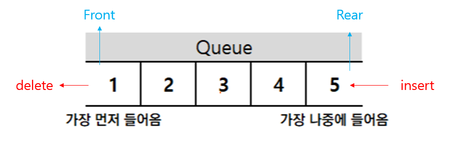
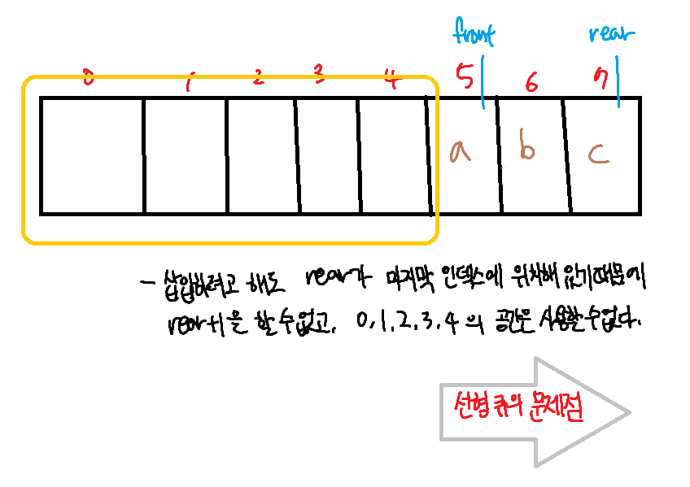

# Queue
---

## 개념
---
먼저 집어 넣은 데이터가 먼저 나오는 **FIFO(First In First Out)구조**로 저장하는 방식

## 용어
---
- **Front** : 첫 번째 데이터
- **Rear** : 가장 마지막 데이터
  > **front, rear의 초깃값 : -1**


## 연산
---
- **FIFO** - First In First Out
- **Enqueue** : 데이터를 **삽입**하는 동작
  - **add(item)**  item을 리스트의 끝부분에 추가
    - ***rear = rear + 1 후 item 추가***
- **Dequeue** : 데이터를 **삭제**하는 동작
  - **remove** : 리스트의 첫 번째 항목을 제거
    - ***front = front + 1***
- **peek** : 큐에서 가장 위에 있는 항목을 반환
- **isEmpty** : 큐가 비어있을 때 true를 반환
  - ***(front == rear) ? True : False***
- **isFull** : ***rear = n - 1***

## 종류
---
 ### **선형**
  
  - 1차원 배열의 형태로 이루어져있습니다.
 ### **환형**
  > **선형 큐의 문제점**
  
   - front와 rear의 값이 계속 증가하기 때문에 언젠가는 **배열의 끝에 도달하게 되고 배열의 앞부분이 비어있더라도 사용하지 못합니다**.
   - 따라서 **원(환)형 큐**가 나오게 되었습니다.
  
  
  - front 앞의 남은 공간을 사용하지 못하는 선형큐의 문제점을 해결하기 위해 고안된 원형큐는 배열의 시작과 끝이 이어져 있는 것처럼 사용하기 위해 **(rear+1)%arraysize**의 형식으로 포인터를 증가시킵니다.


## 구현
---
> **선형큐**
```python
class LinearQueue:
    def __init__(self):        
        self.front = -1
        self.rear = -1
    
    def create_queue(self, size):
        self.queue = list([0 for i in range(size)]) #python의 list는 null값이 들어갈 수 없기 때문에 0이 빈 값이라고 생각하자

    def add(self, item):
        self.rear += 1
        self.queue[self.rear] = item
        
    def remove(self):
        self.front += 1
        self.queue[self.front] = 0

    def peek(self):
        return self.queue[self.rear]

    def isEmpty(self):
        if self.front == self.rear:
            return True
        return False

    def isFull(self):
        if self.rear == len(self.queue) - 1:
            return True
        return False
```

> **원형 큐**
```python
class CircularQueue:
    def __init__(self):
        self.front = -1
        self.rear = -1

    def create_queue(self, size):
        # python의 list는 null값이 들어갈 수 없기 때문에 0이 빈 값이라고 생각하자
        self.queue = list([0 for i in range(size)])
        print(len(self.queue))

    def add(self, item):
        if self.isFull:
            print('배열이 꽉찼습니다.')
        else:
            self.rear += 1
            if self.rear >= len(self.queue):
                self.rear %= len(self.queue)
            self.queue[self.rear] = item
        print(self.queue)
        print('front: {} rear: {}'.format(self.front, self.rear))

    def remove(self):
        if self.isEmpty:
            print('배열이 비었습니다.')
        else:
            self.front += 1
            if self.front >= len(self.front):
                self.front %= len(self.queue)
            self.queue[self.front] = 0
        print(self.queue)
        print('front: {} rear: {}'.format(self.front, self.rear))

    def peek(self):
        return self.queue[self.rear]

    def isEmpty(self):
        if self.front == self.rear:
            return True
        return False

    def isFull(self):
        if self.rear == len(self.queue) - 1:
            return True
        return False
```

> **실제 코딩테스트에서는 collections 모듈의 deque를 사용하자!**

```python
from collections import deque

queue = deque()

# 리스트의 append와 같은 동작
queue.append()
# 가장 왼쪽에 있는 원소 pop
queue.popleft()

print(queue) #먼저 들어온 순서대로 출력
print(queue.reverse()) #나중에 들어온 원소부터 출력
```