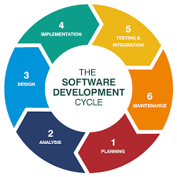
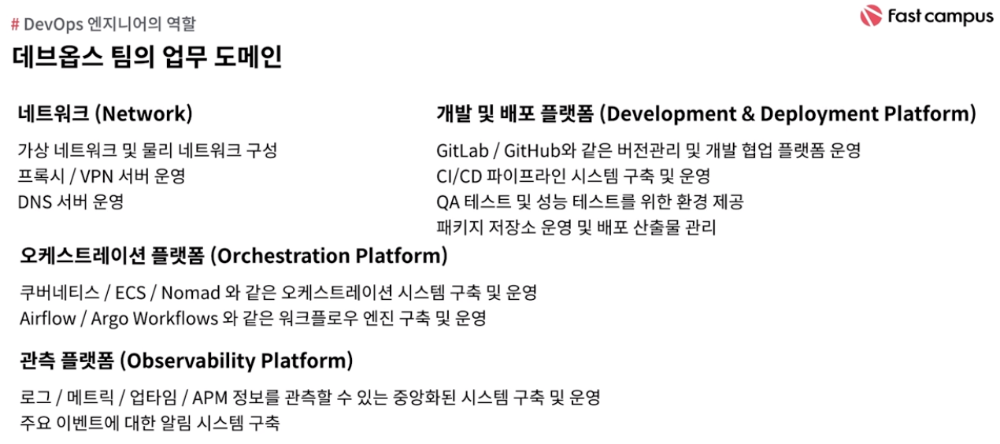
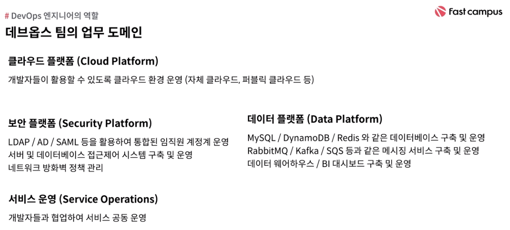

# DevOps introduction

## 정의

- in wikipedia

        a set of practices intended to reduce the time between committing a change to a system and the change being placed into norma production, while ensuring high quality

- _'제품의 변경사항을 품질을 보장함과 동시에 프로덕션에 반역하는데 걸리는 시간을 단축하기 위한 실천 방법의 모음'_

개발팀과 통합/운영팀 통합 필요성 -> 서버의 클라우드화와 동시에 발전

### SDLC (Software Development LifeCycle)

- 조직의 규모가 커지면서 의사소통 많아짐 -> 커뮤니케이션 문제 발생 -> 병목구간 생기기 쉬움

- 개발자가 스스로 테스트하고 배포하고 운영에 참여 가능 -> 의사소통의 효율화
  => Full-cycle Developer

### DevOps의 목표

- 개발과 운영의 벽을 허물어 더 빨리 자주 배포하자!

다양한 데브옵스 실천방법 존재 ex) on AWS

- CI/CD
- Micro-services
- IaC
- Monitoring & Logging
- Communications & Collaboration

## DevOps 업무 도메인

## 데브옵스 핵심 지표

DevOps에 대한 정보들, 공부해야하 것들은
[DevOps-roadmap](https://roadmap.sh/devops) 참고
