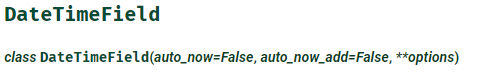
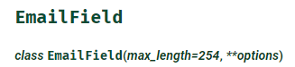
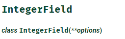
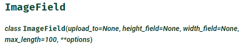
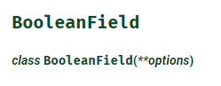

#  Django - Model
---

Python의 Web framework인 **Django**에서는 **ORM**을 기본 제공한다.
이를 쉽게 사용하기 위해 app 디렉토리의 models.py에 class 형태로 테이블을 정의하여 사용한다.

## model 정의
---
- models.py
```python
from django.db import Model

class User(Model.models):
    username = models.CharField(max_length=100)
    email = models.EmailField()
    pwd = models.CharField(max_length=200)
    
```
- django.db모듈의 Model.models를 상속받아 기본 모델의 틀을 만든다.
- class의 이름으로 만들어질 Table의 이름을 명시한다.
- django ORM과 연결될 DB는 settings.py에서 설정한다.
> django model을 만들 때 **primary_key를 지정하지 않으면** **id라는 이름의 AutoField 필드**가 primary_key가 되어 자동으로 만들어진다.


### Migration

```bash
# 마이그레이션 파일 생성
$ python manage.py makemigrations <app-name>
# 마이그레이션 적용
$ python manage.py migrate <app-name>
```
## Field types
---
- [Django documentation - model-field-types](https://docs.djangoproject.com/en/3.1/ref/models/fields/#model-field-types)




> - **auto_now**: 해당 객체가 저장될때(Model.save())의 날짜를 자동으로 업데이트 한다.
> - **auto_now_add**: 객체가 최초 저장(insert)시의 날짜를 자동으로 적용한다.


- CharField이지만 EmailValidator를 사용하여 이메일의 형식을 검사한다.




-  FileField의 속성과 메서드를 상속받고, height와 width 속성을 가진다.





- Integerfield를 상속받고 auto_increment를 적용하는 필드타입

## Field name restrictions
- Python 내장 예약어 사용 X
- underscore(_) 두개 이상 사용 X 
```python
pass = models.BooleanField() # => X
foo__bar = models.IntegerField() # => X
```

## Foreign Key
---
- 1 : N 관계
- fk name은 보통 참조되는 Table 명에 _id가 붙어 만들어진다.
- ForeignKey의 값은 NULL이거나 부모테이블의 기본키 값과 동일해야 함
```python
# 직접 class 매핑해주기
from account.models import User

class Post(Model.models):
    email = models.ForeignKey(User)

# 'appLabel.모델이름' 형식으로 명시
class Post(Model.models):
    email = models.ForeignKey('account.User')
```

- 위와 같이 2가지의 방법이 있는데, 앱끼리 모델명이 중복되는 경우가 있기 때문에 아래의 형식을 선호한다.

- **on_delete** 
  - 참조무결성을 유지하기위해 ForeignKey가 바라보는 값이 삭제될 때의 처리를 미리 옵션으로 지정한다.
  - CASCADE
    - ForeignKeyField가 바라보는 값이 삭제될 때 해당 ForeignKeyField를 포함하는 모델 인스턴스(row)도 삭제한다.
  - PROTECT
    - ForeignKeyField가 바라보는 값이 삭제될때 삭제되지 않도록 ProtectedError를 발생시킨다.
  - SET_NULL
    - ForeignKeyField가 바라보는 값이 삭제될때 해당 ForeignKeyField의 값을 null로 바꾼다. (단, null=True일 때만 가능)
  - SET_DEFAULT
    - ForeignKeyField가 바라보는 값이 삭제될 때 ForeignKeyField값을 default값으로 바꾼다.(default값이 있을 때만 가능)
  - SET()
    - ForeignKeyField가 바라보는 값이 삭제될 때 SET에 설정된 함수 값에 의해 설정된다.

  - DO_NOTHING
    - ForeignKeyField가 바라보는 값이 삭제될 때 아무런 행동을 취하지 않는다. 참조무결성을 해칠 위험이 있다.

