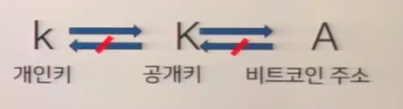

# 블록체인 - Blockchain
---

## 비트코인의 거래
---

- 거래 내역이 약 15000개의 노드에 전달

### P2P - Peer-to-peer network
---
서버나 데이터베이스에 저장되어 사용자가 다운로드 받는것이 아닌 사용자 간의 통신을 한다.

## BlockChain
- **P2P**로 연결된 거래내역 저장소
- **한번 기록되면 데이터가 삭제될 수 없음**
만약 블록체인에서 수정과 삭제가 가능하다면 신뢰성이 깨진다.
- **위조 불가능**
P2P 방식을 통해 모두가 거래내역을 공유하고 있다

- **특징**
- 데이터를 생성한 사람 식별 가능
- 한번 저장된 데이터는 수정과 삭제가 불가능
=> 신뢰성, 빠른 처리

## 비트코인의 부인방지
---
### 비트코인 지갑의 최소조건

- 데이터가 블록체인에 저장될 때 A의 개인키로 암호화하여 저장
=> **데이터의 주인 식별 가능**

## 블록체인
---
### 블록체인에서 블록의 의미 in bitcoin
- 전 세계에서 나오는 거래내역을 **약 10분 단위로 나누어 한 블럭**을 이룸

- **해시 알고리즘**
해시 알고리즘의 특징
-> ***출력값을 통해 입력값을 유추할 수 없다.***

**위변조 방지**
- 원본 값의 해시코드를 추출했을때, 저장된 해시코드와 동일하다면 내용이 위조되지 않음

### 블록의 구성

- 블록은 이전 블록의 해시 코드를 가지고 있기 때문에 위변조를 방지 할 수 있다.
- 2009년에 사토시 나카모토가 처음 한 거래가 있는 블록부터 해당 블록의 거래까지의 해시코드를 계속 비교하여 위변조를 방지함

### 비트코인 채굴
#### 작업 증명(POW: Proof of work)
- 해시코드