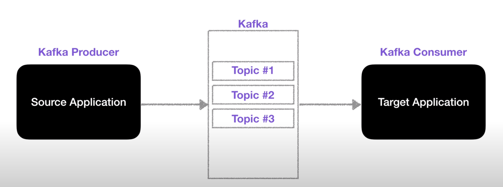
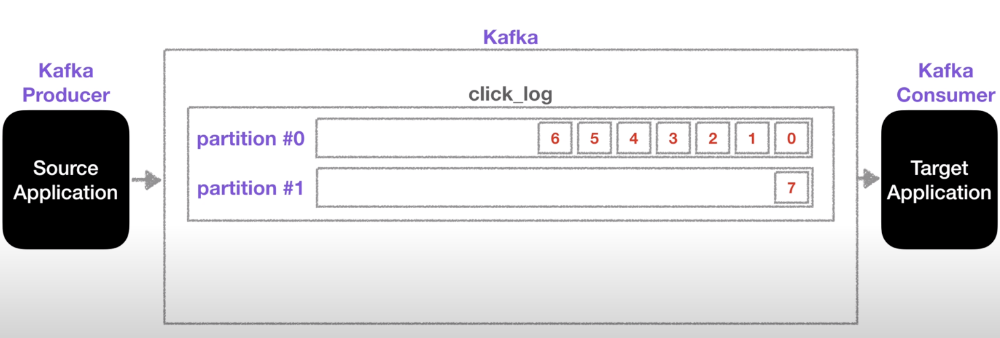

## Kafka 핵심기능

기존 e2e(End-to-End) 기반 아카텍처에서는 다양한 애플리케이션들이 데이터를 처리하기 위해 서로 얽혀있게 된다.

이는 도입하는 애플리케이션이 많아질 수록 복잡해지게 되고 유지보수가 매우 힘든 상황에 마주하게 된다.

**Kafka는 Source Application과 Target Application 간의 Coupling을 약하게 하기 위해 만들어졌다.**

- Source App: Kafka에 데이터 생성
- Target App: Kafka에 저장된 데이터 소비

## 핵심 기능

        - Broker
        - Producer/consumer
        - Topic
        - Partition
        - Record
        - Replication
        - ISR
        - Lag

### Topic & Partition

- **Topic**

Topic은 *데이터베이스의 테이블, 파일시스템의 폴더*와 같은 역할을 한다.
따라서 Topic에는 데이터를 넣을 수도 있고 이를 다시 가져와서 사용할 수도 있다.
이때 *데이터를 넣는(생성) 역할*이 바로 **Producer**이고 *데이터를 가져와 사용하는 역할*이 **Consumer**이다.

**구성요소**

- **Partition**

하나의 Topic은 한 개 이상의 Partition으로 구성된다.
Partition은 Queue 형식으로 데이터의 입출력이 진행된다.
Partition에 데이터가 들어갈 때는 Queue의 FIFO 구조처럼 **맨뒤에 데이터가 들어가고 가장 오래된 데이터가 먼저 빠져나가게 된다.**

Consumer가 Topic에서 데이터를 가져올때는 해당 topic의 partition에 저장되어있는 정보들중 가장 오래된 데이터부터 가져가고 더이상 가져갈 데이터가 없다면 또 다른 데이터가 들어올떄까지 기다린다.

이때 중요한 부분은 컨슈머가 데이터를 가져간다고 해도 partition에 있는 데이터는 삭제되지 않는다.
이는 Kafka의 특징인 **Undeleted Log**에 해당한다.
따라서 다른 컨슈머 그룹에서 해당 파티션의 데이터를 똑같이 가져갈 수 있게 된다.

하지만 이 특징에는 몇 가지 조건이 있는데

- 컨슈머 그룹이 다를 경우
- _auto.offset.reset_ 옵션이 **earliest**로 설정 되어있어야 성립한다.

* Multi Partition

파티션에 데이터를 저장할 때는 'key'를 지정할 수 있는데, 만약 키를 지정하지 않은 경우에는 round-robin 방식으로 데이터가 여러 파티션에 나누어져 들어가게 된다.

만약 키를 지정한 경우에는 키를 해쉬하여 그 이름에 파티션이 하나 할당되어 해당 키값으로 들어오는 데이터는 해당 파티션에 적재되게 된다.

하지만 파티션을 늘리게 되는 경우 굉장히 조심해야하는데,

할당된 파티션의 구조가 깨지기도 하고 파티션을 늘릴 수는 있지만 줄일 수는 없기 때문이다.

### Broker

브로커는 Kafka가 설치된 서버를 의미한다.
