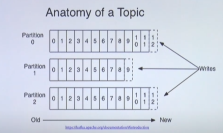

# Kafka

- LinkedIn 데이터팀에서 개발한 분산 데이터 스트림 처리 도구
  

## Kafka는 왜 만들어졌는가?

기존의 데이터 파이프라인 아키텍처


- 기존의 아키텍처에서는 redis나 rabbitMQ와 같은 서비스들을 사용하고 있었는데 이는 *각 애플리케이션마다의 특징을 모두 맞추어야하는 문제점*을 만들어냈다.
- 즉, **데이터 파편화가 심각**해졌고 이는 **서비스의 유지보수를 어렵게 만들었다.**

위 문제점을 해결하기 위해

- 데이터의 중앙집결화
- 대용량 데이터 실시간 수집
- 사용자의 실시간 스트림으로 데이터 소비

할 수 있는 도구가 필요했고 그 도구가 바로 **Kafka** 이다.

## Kafka의 특징

1. High throughout messaging capacity

<<<<<<< HEAD
- 짧은 시간안에 데이터의 처리 가능

2. Scalability와 fault tolerent : 확장성과 고가용성

- broker와 replication을 활용하여 쉽게 확장할 수 있고 브로커가 죽더라도 복제된 다른 브로커에서 쉽게 복구가 가능하다.

3. Undeleted Log

- 타 플랫폼과 달리 컨슈머가 데이터를 소비해도 데이터는 삭제되지 않는다.

## Kafka의 사용성

여러 애플리케이션에서 나오는 빅 데이터 수집 및 처리 시스템

- 하지만 소규모의 스타트업에서도 사용하는 것을 추천한다.
  그 이유는 바로 **확장성과** **고가용성**에 있다.
  스타트업은 급속도로 성장할 수 있기 때문에 높은 확장성을 필요로 한다. Kafka는 broker를 통해 쉽게 확장시킬 수 있고 만약 브로커에 문제가 생기더라도 replication을 통해서 쉽게 복구가 가능하기 때문에 쉽게 도입할 수 있다.
=======
### Kafka broker
- 실행된 카프카 애플리케이션 서버 중 1대
- 3대 이상의 브로커로 클러스터 구성
- Zookeeper와 연동필요
  - Zookeeper(Apache Zookeeper)
    - Kafka 메타데이터 저장
- 브로커 중 1대는 컨트롤러 기능 수행
  - Controller
    - 각 프로커에게 담당파티션 할당
    - 브로커 정상 동작 모니터링

### Record
```java
new ProducerRecord<String, String>("topic", "key", "message);
```

```java
ConsumerRecords<String, String> records = consumer.poll(1000);
for (ConsumerRecord<String, String> record : records) {
  ...
}
```

객체를 byte형태로 저장하기 위해 **Serialize/Deserialize** 필요

* Serializer
- 기본으로 String Serializer를 제공
- 다양하게 Custom하여 사용
ex) key = null, value = json formatting

### Topic & Partition



- 메시지 분류 단위
-  n개의 파티션 할당 가능
-  각 파티션마다 고유한 오프셋(offset)을 가짐
-  메시지 처리순서는 파티션별로 유지 관리됨
*Queue(FIFO) 구조로 파티션에 데이터가 들어가지만 정확하게 FIFO 구조로 데이터입출력이 이루어지지는 않음

### Kafka log and segment
- 실제로 저장은 파일시스템으로 not a DB
- 메시지가 저장될때는 세그먼트파일이 열려있음
- 세그먼트는 시간 또는 크기 기준으로 닫히고, 닫힌 이후 일정 시간에 압축, 삭제됨
* 일정시간이 지나면 데이터가 사라짐


>>>>>>> 8cb5216a43ac366ada7b0a4bb8116b173c2041dd
