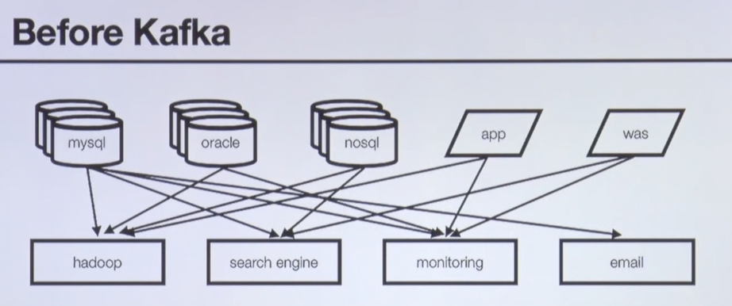
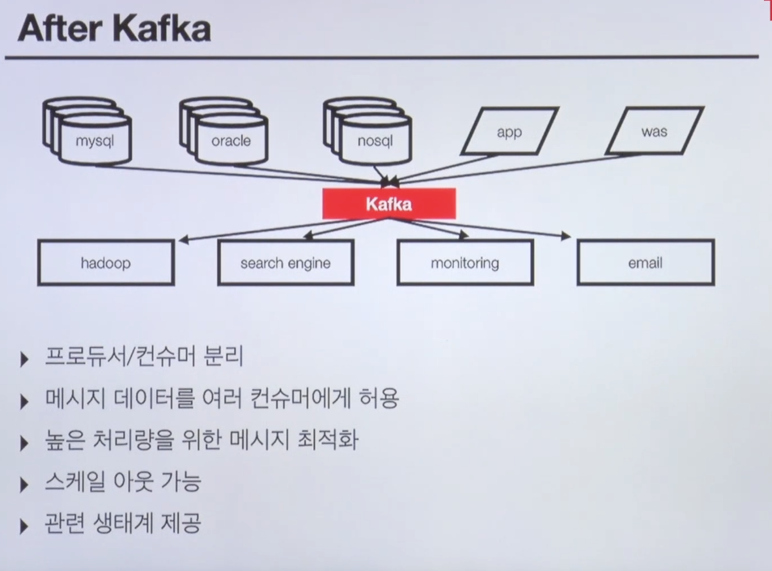

# Kafka

## Kafka 생태계



기존 데이터 파이프라인 아키텍처에서는 
- e2e 연결 방식의 아키텍처
- 각각 다른 데이터 파이프라인 연결 구조
- 확장의 어려움

      Linkedin의 데이터팀에서 이러한 문제점을 해결하기 위해 *모든 시스템으로 데이터를 전송*, *실시간 처리가* 가능하고 데이터가 갑자기 많아지더라도 *확장이 용이*한 시스템을 자체 개발한 것이 바로 Kafka



- producer/consumer 분리(데이터 제공자, 소비자)
- 메시지 데이터 여러 컨슈머에게 허용
- 높은 처리량을 위한 메시지 최적화
- Scale Out
- 관련 추가 생태계


1. app, was, db의 데이터를 Log definition tool을 통해 정한대로 수집
2. Streaming 데이터는 Kafka, Batch용 데이터는 따로 해서 수집
3. 이를 최종 데이터 저장소인 Hadoop에 저장
4. Hive 등과 같은 EDA툴로 데이터 활용


## Kafka broker, cluster

### Kafka broker
- 실행된 카프카 애플리케이션 서버 중 1대
- 3대 이상의 브로커로 클러스터 구성
- Zookeeper와 연동필요
  - Zookeeper(Apache Zookeeper)
    - Kafka 메타데이터 저장
- 브로커 중 1대는 컨트롤러 기능 수행
  - Controller
    - 각 프로커에게 담당파티션 할당
    - 브로커 정상 동작 모니터링

### Record
```java
new ProducerRecord<String, String>("topic", "key", "message);
```

```java
ConsumerRecords<String, String> records = consumer.poll(1000);
for (ConsumerRecord<String, String> record : records) {
  ...
}
```

객체를 byte형태로 저장하기 위해 **Serialize/Deserialize** 필요

* Serializer
- 기본으로 String Serializer를 제공
- 다양하게 Custom하여 사용
ex) key = null, value = json formatting

### Topic & Partition


- 메시지 분류 단위
-  n개의 파티션 할당 가능
-  각 파티션마다 고유한 오프셋(offset)을 가짐
-  메시지 처리순서는 파티션별로 유지 관리됨
*Queue(FIFO) 구조로 파티션에 데이터가 들어가지만 정확하게 FIFO 구조로 데이터입출력이 이루어지지는 않음

### Kafka log and segment
- 실제로 저장은 파일시스템으로 not a DB
- 메시지가 저장될때는 세그먼트파일이 열려있음
- 세그먼트는 시간 또는 크기 기준으로 닫히고, 닫힌 이후 일정 시간에 압축, 삭제됨
* 일정시간이 지나면 데이터가 사라짐


