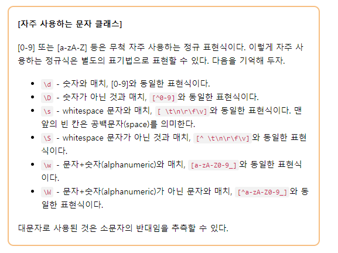

# 정규표현식
---
복잡한 문자열을 처리할 때 사용하는 기법으로 , python만의 고유 문법이 아닌 문자열을 처리하는 모든 곳에서 사용한다.

## Why?
- 정규표현식을 사용하면 코드를 간소화 할 수 있다. 문자열에서 특정 문자를 찾거나, 규칙을 지정하는 경우에 자주 쓰인다.

## 메타 문자 (meta characters)
---
- 메타 문자란 원래 그 문자가 가진 뜻이 아닌 특별한 용도로 사용하는 문자
- 정규표현식에서 사용하는 메타 문자
  - ``` . ^ $ * + ? { } [ ] \ | ( )```
  
#### 문자 클래스 [ ]
- [] 사이의 문자들과 매치
- 정규표현식이 [abc]라면 이 포현식은 "a, b, c 중 한개의 문자와 매치"를 뜻한다.
- []안의 두 문자 사이에 하이픈(-)을 사용하면 두 문자 사이의 범위(From-To)를 의미한다
  - [a-zA-Z] - 알파벳 모두
  - [0-9] - 숫자


