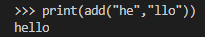
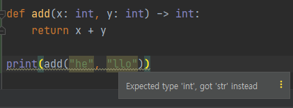
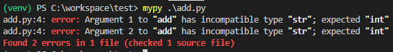

# Python typehint
---

프로그래밍 언어에는 다양한 자료형이 있습니다. 이러한 자료형들은 하나씩 변수에 매핑되어집니다. 그런데 예상치 못한 자료형으로 데이터가 들어온다면 이는 오류를 유발합니다. 또한 프로그래밍 할때 변수의 타입을 명시한다면 좀 더 구조적으로 설계 할 수 있습니다. 따라서 다양한 프로그래밍 언어(typescript, kotlin, python 등)에서 Annotation를 지원합니다.

오늘은 Python에서 지원하는 typehint에 대해서 알아보겠습니다.


* Type Annotation과 typing 패키지 모두 어떤 타입인지 코드상에서 명시하고 에디터 레벨에서 경고를 띄워줄 뿐입니다. 이에 대한 예외처리는 직접 구현해야합니다.

## Type Anotation
```python
def add(x: int, y: int) -> int:
    return x + y
```
위의 코드와 같이 함수의 파라미터와 반환값의 타입을 지정해줄 수 있습니다.

그렇다면 위의 함수에
```python
print(add("he", "llo"))
```
이렇게 지정한 타입과 다른 타입의 데이터를 파라미터로 전송하면 어떻게 될까요?


두 문자열로 연결되어 잘 출력되버립니다.
하지만 Pycharm과 같은 에디터에서는

이렇게 표시됩니다.

이는 Python Type Annotation은 단지 코드상에서 명시하고 에디터 레벨에서 경고를 띄워줄 뿐이기 때문입니다.
따라서 이에 대한 예외처리는 직접 구현해야합니다.
하지만 `mypy`라는 패키지를 사용하면 이를 테스트 할 수 있습니다.

```
pip install mypy
```
pip로 간단히 설치할 수 있고

mypy로 위의 코드를 실행시키면

타입을 체크하고 문제가 있다면 오류를 발생시킵니다. 단순한 테스트 이기 때문에 문제가 없다고 해도 아무것도 출력되지 않습니다.

## `typing`
만약 int, str 같이 단순한 타입이 아닌 복잡한 타입을 사용한다면 `typing`패키지를 사용하면 됩니다.

해당 패키지는 Python에서 지원하는 패키지로 `3.5`버전 이후의 파이썬에서는 기본으로 제공됩니다.

만약 정수만 포함하는 리스트를 받는다면
```python
from typing import List

def add(x: List[int]) -> int:
    return sum(x)

print(add([1,2,3]))
```
List 뿐만 아니라 Dict, Tuple 등등 다양한 타입을 지원합니다.

### Type Aliases
`New Type` 을 사용하여 타입에 별칭을 붙일 수 있습니다.
```python
from typing import List, NewType

UserId = NewType('UserId', int)
user_id = UserId(123)
print(user_id)
# 출력: 123
print(type(user_id))
# 출력: <class 'int'>


IdList = NewType('IdList', List[int])
id_list = [1, 2, 3]
print(IdList(id_list))
# 출력: [1, 2, 3]
print(type(id_list))
# 출력: <class 'list'>
```

### `Callable`
함수인자에 다른 함수를 넘겨줄떄는 `Callable`을 사용하면 됩니다.

사용 : `Callable[[인자타입리스트], 반환 타입]`형식
```python
from typing import Callable


def add(x: int, y: int) -> int:
    return x + y


def subtract(x: int, y: int) -> int:
    return x - y


def call_func(x: int, y: int, func: Callable[[int, int], int]) -> int:
    return func(x, y)


call_func(10, 20, add)
call_func(10, 20, subtract)
```

### `TypeVar`, `Union`, `Optional`
`TypeVar`를 사용하면 제네릭 타입을 구현할 수 있습니다. 
```python
class TypeVar(_Final, _Immutable, _root=True):
    Usage::

      T = TypeVar('T')  # Can be anything
      A = TypeVar('A', str, bytes)  # Must be str or bytes
    def __init__(self, name, *constraints, bound=None,
                 covariant=False, contravariant=False):
```
위는 typing 패키지의 TypeVar 모듈의 내용 중 일부 입니다. 
여러 자료형 중 하나를 받아야 할 떄는 `TypeVar`에 여러 타입을 전달하거나 `Union`,`Optional`을 사용하면 됩니다. 이때 필수적인 인자가 아니라면 `Optional`을 사용합니다.

```python
from typing import TypeVar, Union, Optional


Numeric = TypeVar('Numeric', int, float)
Numeric2 = Union[int, float]
OptionalNumeric = Optional[int, float]

# Optional[T]는 Union[T, None]와 같다
```


이렇게 Python에서 typehint를 사용할 수 있는 방법에 대해서 알아보았습니다.