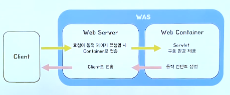

# Web Server vs WAS
---
- Web Server와 WAS(Web Application Service)에 대해서 알아보고 차이점을 알아봅니다.
## Web Server
---
### Web
인터넷을 기반으로 한 정보를 공유, 검색할 수 있는 서비스
- 구성
> URL(주소)
> HTTP(통신 규칙)
> HTML(내용)

### Server
- 클라이언트에게 네트워크를 통해 정보나 서비스를 제공하는 컴퓨터 시스템

**아 그럼 Web Server란**
> 💡 **인터넷을 기반으로 클라이언트에게 웹 서비스를 제공하는 컴퓨터**

즉, 클라이언트가 URL을 통해 HTTP 방식으로 요청을 보내면 그에 맞는 내용(HTML)을 응답해주는게 Web Server입니다.

하지만, 클라이언트가 특정한 상황이 아닌 동적인 요청을 보냈을 때는 해당 상황에 맞는 응답을 하나하나씩 짜야하는 불편함이 있습니다.
> 😦 왜? 
>HTML은 프로그래밍 언어가 아니기 떄문에....
>HTML 단독으로는 바뀌는 데이터에 대해 처리를 할 수 없습니다...

즉, 클라이언트의 정적인 요청은 Web Server가 단독으로 처리할 수 있지만 동적인 요청이 들어오게 된다면 WAS의 도움이 필요합니다.

**예시**
Apache Server, Nginx, IIS 등

😊 그래서 등장한 것이 바로, **WAS(Web Application Server)**입니다.

## Web Application Server
---

- Web Application
웹에서 동작하는 응용프로그램

- Web Application Server
웹 애플리케이션과 서버 환경을 만들어 동작시키는 기능을 제공하는 소프트웨어 프로그램
>웹 애플리케이션을 실행하여 필요한 기능을 수행하고 그 결과를 웹 서버에 전달하는 **미들웨어**

- 구성

**WAS = Web Server + Web Container**

**동작방식**
1. 클라이언트가 Web Server에게 요청
2. 동적 요청인 경우 요청을 WAS에 전송하면
3. WAS가 요청 처리하고
4. WAS가 처리한 결과를 Web Server에 다시 보내어
5. Web Server는 그 결과를 클라이언트에게 전달(응답)합니다.

## 😦 So, WAS와 Web Server의 차이점은?
### "상황에 따라 변하는 정보를 제공할 수 있는가?"
이말은 즉, 클라이언트의 동적인 요청을 처리 할 수 있는가?로 해석할 수 있을 것 같습니다.